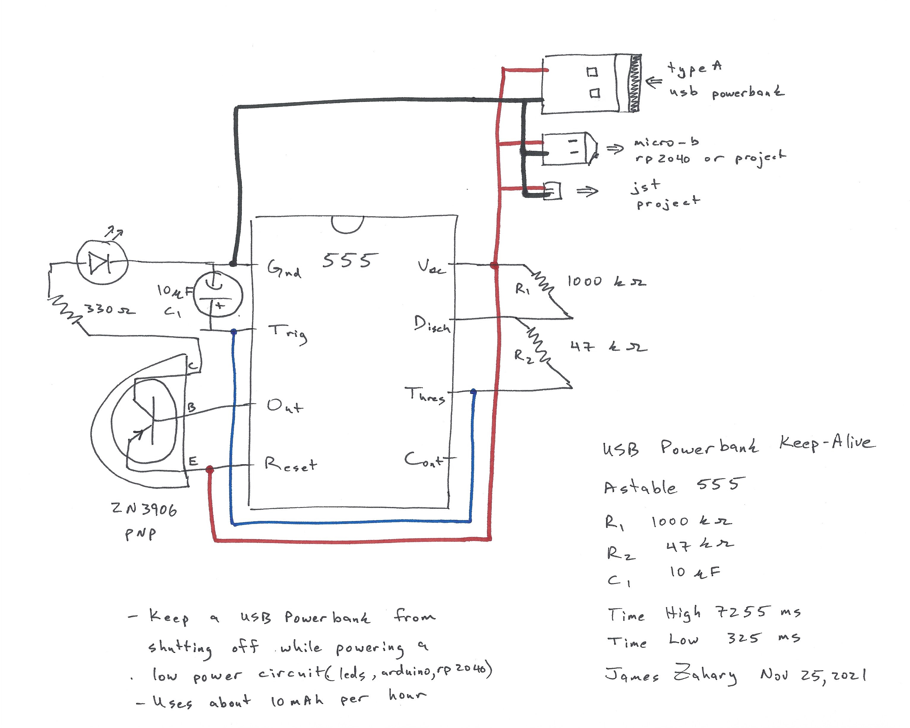

# usb-powerbank-keepalive
Keep a USB powerbank from shutting off while powering a low power project

USB Powerbank have a nasty habit of shutting off if you don't use enough power.  This might be fine if you are charging a phone, but if you are using them to power a small arduino or led project, it is a problem that needs regular AA batteries, or you have to get 18650s and build your own charging and protection circuit, ... or you can use this:

This uses a 555 timer, 3 resistors, 1 transistor, 1 capacitor, and 1 led (maybe 25 cents of materials?), and will swallow enough current to keep your USB power bank from shutting off while it powers a small power arduino, rp2040, or led project.  The works by turning on the led (plus the transistor and resistor) for about 1/3 of a second, every 8 seconds.  That is enough to convince the powerbank that it is doing something and should not shut off.  This curcuit uses about 10 mAh per hour or about 250 mAh per day, and since this power bank contains about 1750 mAh, it will run for about a week just with this circuit -- any power your project uses is extra.  So it is not a solution to a deep-sleeping microcontroller that you want to run for a month, but a project that you want to run for a couple days, and then recharge the battery, or run off and on with a power switch, but you don't want to burn AA batteryes, and you don't want to build your own battery system.

Some powerbanks -- including this particluar model -- can be be tricked into operating for 1/8 of a second every 15 seconds -- you can do this by switch the 1000 k-ohm ro 2000 k-ohm (the 15 seconds), and switch the 47 k-ohm to 22 k-ohm.  I find the bigger and fancier the USB-powerbank, the more power you have to swallow to keep its attention, so this 3/8 every 8 second was a nice median.

This picture shows another innovation of soldering a wire to the +5 and GND of the USB connector, so you can use the power without the giant type A usb connector.  You have to be careful opening powerbanks, and solder to a battery is dangerous, but you can add a couple wires to the USB connector that is an inch away from the battery.

Here are the calulations from the digikey website.

This powerbanks also seem to have some circuit that detects when the load drops to zero, and the powerbnak will reset.  So sometimes you have to unplug your rp2040, and plug it in again for the powerbank to resume delivering 5v power.  A previous version of this same brand used to give me 5v when it was needed, and then shut off the boost circuit, and give me 3.9 or 4.1 volts that the battery was providing, and then boost it up to 5v when the demand resumed.  Anyone know how that works?

Also, I have a different solution for an rp2040 device -- it does not work for sleeping mode, but if the rp2040 is running you can just turn on a gpio and short it to ground through a 10 ohm resitor for 125 millis-seconds every 15 seconds, and it will keep this model of usb-powerbank awake.  It would be more efficient than this hardware solution.  Some powerbanks I have require 350 ms, or 2 gpios to be shorted through a 10 ohm resistor, or this one shown can be fooled by 125 ms through a 10 ohm, and a led with a 330 ohm resistor through another gpio -- the flashing light gives you an idication that the keep-alive is working.

